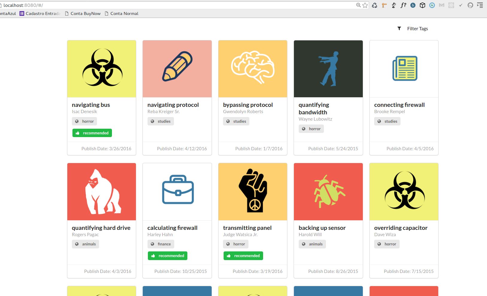

# bookrazy  

Its a experimental angular app. Cool features:
- [x] Webpack build system
- [x] **Modular Angular Pattern**
- [x] E2E Tests - dalekjs
- [x] Animation loader
- [x] Interactive filters
- [x] Recommended books: -> Publish Date on Friday or Hallowen
- [x] Cool images made by me. The images are linked to each gender
- [x] Fakes titles and names
- [x] Generate 1 milion list with infinite-scroll

## Technologies:
- Angular 1.x
- Karma
- Webpack
- Jasmine
- Gulp
- DalekJS
- Semantic-UI Framework

## Getting Started

**Clone the project**
```sh
$ git clone git@github.com:matheuspoleza/bookrazy.git
```

**Install deps**
```sh
$ npm install
```
**Install gulp global (if necessary)**
```sh
$ npm install -g gulp-cli
```

**Start the app**

```sh
$ gulp start
```

**Thats all! See server running in localhost:8080 :smile:**



## Tests

**Running**
```sh
$ gulp test
```

[MIT](https://github.com/matheuspoleza/bookrazy/LICENSE.md) © Matheus Poleza.
